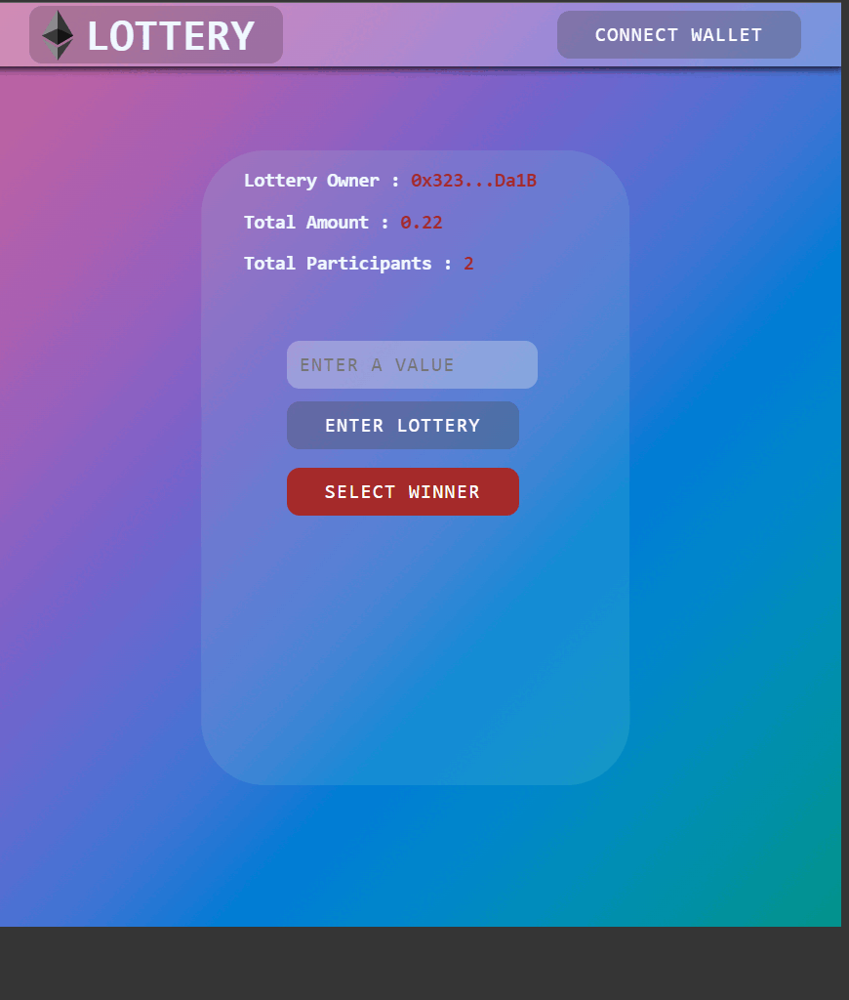

**_
 Web3.0 Projects | 1 - Lottery
_**

 

In this application [2-Lottery-Basic](https://github.com/ihsan215/Smart-Contract-Projects/tree/main/2-Lottery-Basic) is a DApp application prepared to interact with the Lottery Smart Contract. Basically, the lottery is entered with a minimum of 0.11 ether. And the contract owner chooses a random winner with the button on the interface.

 

  
   

 

The content of the Create Lottery DApp application;

- web3.js
- Fundamental React
- Fundamental JS
- Algorithm
- Fundamental Blockchain
- Metemask
