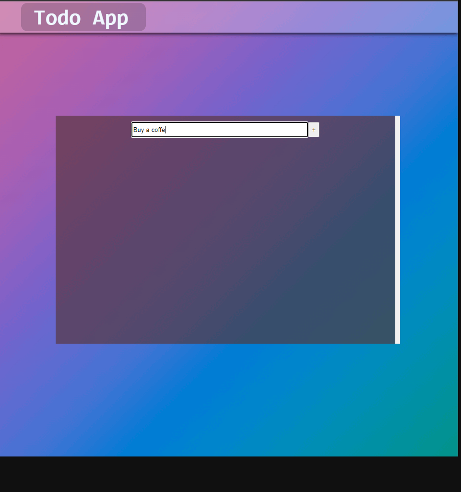

**_
 Web3.0 Projects | 2 - TODO-APP
_**

 

In this application [4-TodoContract](https://github.com/ihsan215/Smart-Contract-Projects/tree/main/4-TodoContractc) It is a DApp for interacting with the To Do Smart Contract. Basically, it's an example of a classic todo implementation on an ethereum network.
 

  
   

 

The content of the Create Lottery DApp application;

- web3.js
- Fundamental React
- Fundamental JS
- React Hooks (useContext,useState,useRef)
- Algorithm
- Fundamental Blockchain
- Metemask
