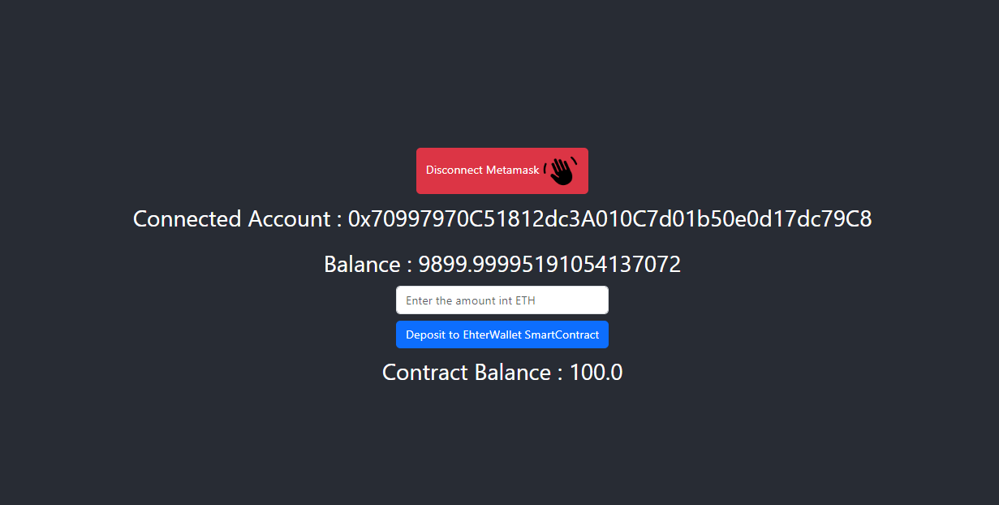

**_
 Web3.0 Projects | 3 - EtherWallet-APP
_**

 

In this application a simple ether wallet appliction.
 

  
   

 

The content of the Create Lottery DApp application;

- ethers.js
- Fundamental React
- Fundamental JS
- React Hooks (useContext,useState,useRef)
- Algorithm
- hardhat
- Fundamental Blockchain
- Metemask
